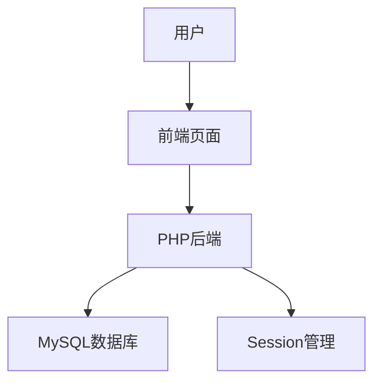
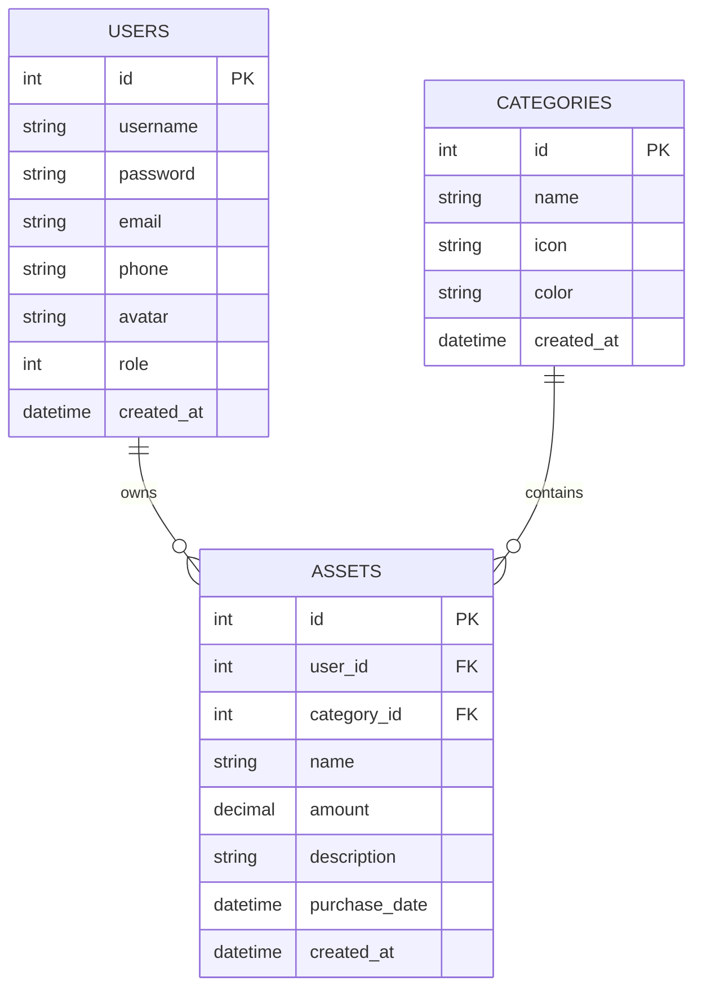

# 个人资产管理系统 - 产品需求文档

## 1. 产品概述

个人资产管理系统是一款面向个人用户的资产管理工具，帮助用户记录、管理和统计个人资产信息，包括现金、银行存款、投资、房产、车辆等各类资产。系统提供资产分类管理、资产增删改查、数据统计分析等功能，让用户清晰掌握个人财务状况，合理规划资产配置。

- 目标用户：需要管理个人资产的普通用户
- 核心价值：资产信息集中管理、财务状况一目了然、数据安全可靠

## 2. 核心功能

### 2.1 用户角色

| 角色 | 注册方式 | 核心权限 |
|------|----------|----------|
| 普通用户 | 注册页面 | 管理个人资产、查看统计 |
| 管理员 | 预置账号 | 用户管理、系统管理 |

### 2.2 功能模块

1. **用户认证模块**：用户注册、登录、退出、个人中心
2. **资产管理模块**：资产增删改查、资产分类、资产搜索
3. **分类管理模块**：资产分类增删改查
4. **数据统计模块**：资产总览、分类统计、图表展示
5. **系统管理模块**：用户管理（管理员）

### 2.3 页面详情

| 页面名称 | 模块名称 | 功能描述 |
|----------|----------|----------|
| 首页 | 系统介绍 | 展示系统功能介绍、使用说明 |
| 登录页 | 用户认证 | 用户登录、记住密码 |
| 注册页 | 用户认证 | 用户注册、表单校验 |
| 后台首页 | 数据统计 | 资产总览、分类统计、图表 |
| 资产列表 | 资产管理 | 资产增删改查、分页、搜索 |
| 资产添加 | 资产管理 | 添加资产信息 |
| 资产编辑 | 资产管理 | 修改资产信息 |
| 分类管理 | 分类管理 | 分类增删改查 |
| 个人中心 | 用户管理 | 修改个人信息、密码 |
| 用户管理 | 系统管理 | 用户列表、删除用户（管理员） |

## 3. 核心流程

### 3.1 用户登录流程

用户访问首页 → 点击登录 → 输入账号密码 → 后端验证 → 登录成功跳转后台首页

### 3.2 资产管理流程

用户登录 → 进入资产列表 → 添加/编辑/删除资产 → 查看统计

### 3.3 系统架构图

## 4. 用户界面设计

### 4.1 设计风格

- **主色调**：深蓝色 (#1e3a5f) 作为主色，橙色 (#f39c12) 作为强调色
- **按钮样式**：圆角矩形，主按钮使用主色调，次按钮使用灰色
- **字体**：系统默认字体，标题加粗
- **布局风格**：左侧导航栏 + 右侧内容区，响应式设计
- **图标**：使用 Font Awesome 图标库

### 4.2 页面设计概述

| 页面名称 | 模块名称 | UI元素 |
|----------|----------|--------|
| 首页 | 系统介绍 | 大图背景、功能卡片、登录入口 |
| 登录页 | 用户认证 | 居中卡片、表单输入、登录按钮 |
| 后台首页 | 数据统计 | 统计卡片、饼图、柱状图 |
| 资产列表 | 资产管理 | 表格、分页、搜索框、操作按钮 |

### 4.3 响应式设计

- 桌面端：左侧固定导航栏，右侧内容区
- 移动端：顶部汉堡菜单，内容区全宽

## 5. 数据库设计

### 5.1 数据表

1. **users** - 用户表
2. **assets** - 资产表
3. **categories** - 分类表

### 5.2 ER图

## 6. 安全设计

- 密码使用 password_hash() 加密存储
- 使用预处理语句防止 SQL 注入
- Session 管理登录状态
- 权限控制防止非法访问
- 表单数据后端校验
- XSS 防护：输出转义

## 7. 运行环境

- PHP 7.4+
- MySQL 5.7+
- Apache/Nginx
- 现代浏览器（Chrome、Firefox、Edge）
