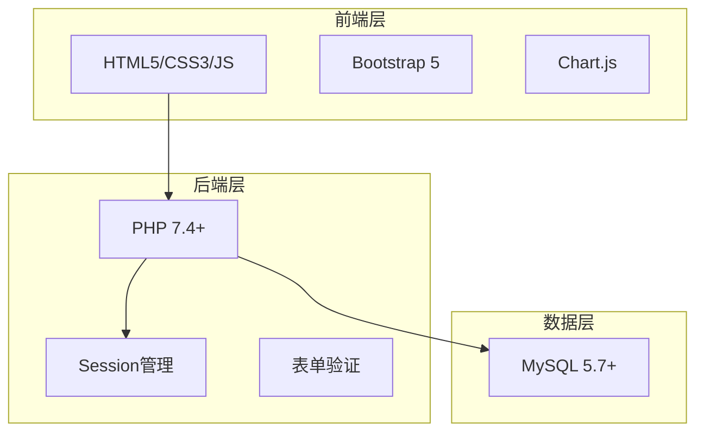

# 个人资产管理系统 - 技术架构文档

## 1. 架构设计



## 2. 技术描述

- **前端**：HTML5 + CSS3 + JavaScript + Bootstrap 5 + Chart.js
- **后端**：PHP 7.4+
- **数据库**：MySQL 5.7+
- **Web服务器**：Apache/Nginx
- **Session存储**：文件系统

## 3. 目录结构

```
personal-asset-manager/
├── assets/                 # 静态资源
│   ├── css/               # 样式文件
│   ├── js/                # JavaScript文件
│   └── images/            # 图片资源
├── includes/              # 公共文件
│   ├── config.php         # 数据库配置
│   ├── db.php            # 数据库连接
│   ├── functions.php      # 公共函数
│   └── auth_check.php     # 权限检查
├── pages/                 # 页面文件
│   ├── login.php          # 登录页
│   ├── register.php       # 注册页
│   ├── dashboard.php      # 后台首页
│   ├── assets.php         # 资产列表
│   ├── asset_add.php      # 添加资产
│   ├── asset_edit.php     # 编辑资产
│   ├── categories.php     # 分类管理
│   ├── profile.php        # 个人中心
│   └── users.php          # 用户管理
├── index.php              # 首页
├── logout.php             # 退出页
└── database.sql           # 数据库脚本
```

## 4. 路由定义

| 路由 | 用途 |
|------|------|
| /index.php | 首页 |
| /pages/login.php | 登录页 |
| /pages/register.php | 注册页 |
| /pages/dashboard.php | 后台首页 |
| /pages/assets.php | 资产列表 |
| /pages/asset_add.php | 添加资产 |
| /pages/asset_edit.php | 编辑资产 |
| /pages/categories.php | 分类管理 |
| /pages/profile.php | 个人中心 |
| /pages/users.php | 用户管理 |
| /logout.php | 退出登录 |

## 5. 数据库设计

### 5.1 用户表 (users)

```sql
CREATE TABLE users (
    id INT PRIMARY KEY AUTO_INCREMENT,
    username VARCHAR(50) NOT NULL UNIQUE,
    password VARCHAR(255) NOT NULL,
    email VARCHAR(100) NOT NULL UNIQUE,
    phone VARCHAR(20),
    avatar VARCHAR(255),
    role TINYINT DEFAULT 0 COMMENT '0-普通用户, 1-管理员',
    created_at DATETIME DEFAULT CURRENT_TIMESTAMP,
    updated_at DATETIME DEFAULT CURRENT_TIMESTAMP ON UPDATE CURRENT_TIMESTAMP
);
```

### 5.2 资产表 (assets)

```sql
CREATE TABLE assets (
    id INT PRIMARY KEY AUTO_INCREMENT,
    user_id INT NOT NULL,
    category_id INT NOT NULL,
    name VARCHAR(100) NOT NULL,
    amount DECIMAL(15,2) NOT NULL,
    description TEXT,
    purchase_date DATE,
    created_at DATETIME DEFAULT CURRENT_TIMESTAMP,
    updated_at DATETIME DEFAULT CURRENT_TIMESTAMP ON UPDATE CURRENT_TIMESTAMP,
    FOREIGN KEY (user_id) REFERENCES users(id) ON DELETE CASCADE,
    FOREIGN KEY (category_id) REFERENCES categories(id) ON DELETE RESTRICT
);
```

### 5.3 分类表 (categories)

```sql
CREATE TABLE categories (
    id INT PRIMARY KEY AUTO_INCREMENT,
    name VARCHAR(50) NOT NULL UNIQUE,
    icon VARCHAR(50) DEFAULT 'fa-folder',
    color VARCHAR(20) DEFAULT '#1e3a5f',
    created_at DATETIME DEFAULT CURRENT_TIMESTAMP
);
```

## 6. 安全设计

### 6.1 密码加密
- 使用 `password_hash($password, PASSWORD_DEFAULT)` 加密
- 使用 `password_verify($password, $hash)` 验证

### 6.2 SQL注入防护
- 使用 PDO 预处理语句
- 所有用户输入参数化查询

### 6.3 XSS防护
- 使用 `htmlspecialchars()` 输出转义
- 设置 Content-Type 和 X-Frame-Options 头

### 6.4 权限控制
- Session 验证登录状态
- 页面访问权限检查
- 管理员权限验证

### 6.5 CSRF防护
- 表单添加 Token 验证
- 敏感操作二次确认

## 7. API接口

### 7.1 用户认证

| 接口 | 方法 | 参数 | 返回 |
|------|------|------|------|
| login.php | POST | username, password | JSON |
| register.php | POST | username, password, email | JSON |
| logout.php | GET | - | 跳转 |

### 7.2 资产管理

| 接口 | 方法 | 参数 | 返回 |
|------|------|------|------|
| assets.php | GET | page, keyword, category_id | HTML/JSON |
| asset_add.php | POST | name, amount, category_id, description, purchase_date | JSON |
| asset_edit.php | POST | id, name, amount, category_id, description, purchase_date | JSON |
| asset_delete.php | POST | id | JSON |

## 8. 性能优化

- 数据库索引优化
- 分页查询限制返回条数
- 静态资源缓存
- Session 优化
